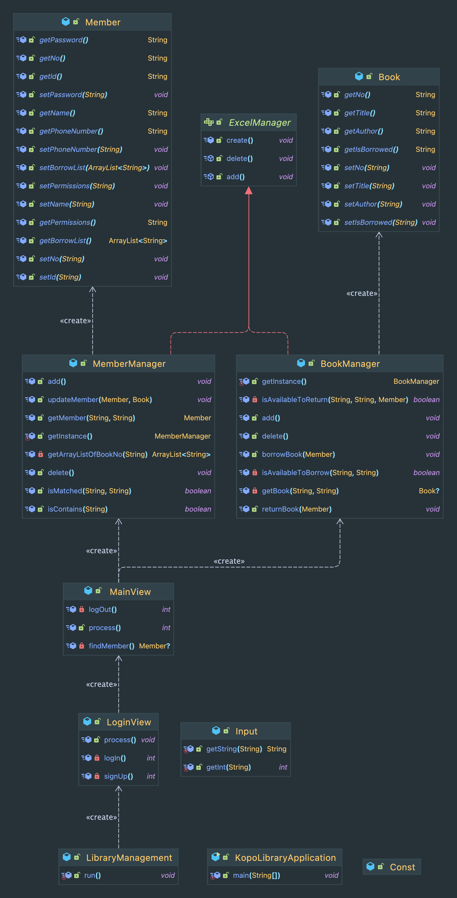

# KOPOLibrary
library management project with java

---

## Requirements
- 데이터 : member, book
- 기능 : 회원등록, 회원삭제, 권한부여, 책등록, 책삭제, 책대여, 책반납

---

## Application Structure
- assets : 정적 데이터
- dto : 객체 단위의 데이터 교환을 위한 클래스
- manager : 엑셀 CRUD
- records : 엑셀 파일 저장 경로
- util : 재사용 함수
- view : 프로그램 사용자에게 띄울 view 관련

---

## install and run KOPOLibrary

### 1. git clone

```shell
git clone git@github.com:jinsumin/KOPOLibrary.git
cd KOPOLibrary
idea .
```
### 2. build tools - maven

build project with maven

### 3. apache poi setting

dependency setting in pom.xml

```html
<dependency>
    <groupId>junit</groupId>
    <artifactId>junit</artifactId>
    <version>4.13.2</version>
    <scope>test</scope>
</dependency>
<dependency>
    <groupId>org.apache.poi</groupId>
    <artifactId>poi-ooxml</artifactId>
    <version>5.2.2</version>
</dependency>
```

### 4. lombok setting

dependency setting in pom.xml

```html
<dependency>
    <groupId>org.projectlombok</groupId>
    <artifactId>lombok</artifactId>
    <version>1.18.22</version>
    <scope>compile</scope>
</dependency>
```
lombok can do this things
```java
import lombok.NoArgsConstructor;
import lombok.AllArgsConstructor;
import lombok.Getter;
import lombok.Setter;

@NoArgsConstructor
@AllArgsConstructor
@Getter
@Setter
public class Book {
    private String no;
    private String title;
    private String author;
    private String isBorrowed;
}

```


### 5. maven reload

---

## build with
java, apache poi, lombok

---

## class diagram


---

## excel manager interface

create KOPOLibrary.xls Excel file with two sheets (member, book)
```java
default void create() throws Exception {
    HSSFWorkbook workbook = new HSSFWorkbook();
    
    HSSFSheet sheetOfBook = workbook.createSheet(BOOK_SHEET);
    HSSFRow rowOfBook = sheetOfBook.createRow(0);
    rowOfBook.createCell(0).setCellValue("No.");
    rowOfBook.createCell(1).setCellValue("TITLE");
    rowOfBook.createCell(2).setCellValue("AUTHOR");
    rowOfBook.createCell(3).setCellValue("IS BORROWED");
    
    HSSFSheet sheetOfMember = workbook.createSheet(MEMBER_SHEET);
    HSSFRow rowOfMember = sheetOfMember.createRow(0);
    rowOfMember.createCell(0).setCellValue("No.");
    rowOfMember.createCell(1).setCellValue("ID");
    rowOfMember.createCell(2).setCellValue("PW");
    rowOfMember.createCell(3).setCellValue("NAME");
    rowOfMember.createCell(4).setCellValue("PHONE NUMBER");
    rowOfMember.createCell(5).setCellValue("PERMISSION");
    rowOfMember.createCell(6).setCellValue("BORROWED LISTS");
    
    FileOutputStream out = new FileOutputStream(FILE_PATH + FILE_NAME);
    workbook.write(out);
    out.close();
}
```

---

## book manager 

add book
```java
@Override
public void add() throws Exception {
    String no = String.valueOf(LocalTime.now());
    String title = Input.getString("책 제목 : ");
    String author = Input.getString("저자 : ");
    String isBorrowed = "false";
    Book book = new Book(no, title, author, isBorrowed);
    FileInputStream fileInputStream = null;
    try {
        fileInputStream = new FileInputStream(FILE_PATH + FILE_NAME);
    } catch (Exception e) {
        System.out.println(e.getMessage());
        BookManager.getInstance().create();
        fileInputStream = new FileInputStream(FILE_PATH + FILE_NAME);
    }
    HSSFWorkbook workbook = new HSSFWorkbook(fileInputStream);
    HSSFSheet sheet = workbook.getSheet(BOOK_SHEET);
    HSSFRow row = sheet.createRow(sheet.getLastRowNum() + 1);
    row.createCell(0).setCellValue(book.getNo());
    row.createCell(1).setCellValue(book.getTitle());
    row.createCell(2).setCellValue(book.getAuthor());
    row.createCell(3).setCellValue(book.getIsBorrowed());
    FileOutputStream fileOutputStream = new FileOutputStream(FILE_PATH + FILE_NAME);
    workbook.write(fileOutputStream);
}
```

borrow, return book
```java
public void borrowBook(Member member) throws Exception {
    String title = Input.getString("책 제목 : ");
    String author = Input.getString("저자 : ");
    if (isAvailableToBorrow(title, author)) {
        MemberManager memberManager = MemberManager.getInstance();
        memberManager.updateMember(member, getBook(title, author));
    }
}

public void returnBook(Member member) throws Exception {
    String title = Input.getString("책 제목 : ");
    String author = Input.getString("저자 : ");
    if (isAvailableToReturn(title, author, member)) {
        MemberManager memberManager = MemberManager.getInstance();
        memberManager.updateMember(member, getBook(title, author));
    }
}
```

delete, get, isAvailable, ...

---

## member manager

add member
```java
public void add() throws Exception {
    String no = String.valueOf(LocalTime.now());
    String id = Input.getString("아이디 입력 : ");
    String password = Input.getString("비밀번호 입력 : ");
    String name = Input.getString("이름 입력 : ");
    String phoneNumber = Input.getString("핸드폰번호 입력 : ");
    String permissions = Input.getString("0.관리자권한 1.일반권한 설정 : ");
    Member member = new Member(no, id, password, name, phoneNumber, permissions, new ArrayList());

    FileInputStream fileInputStream;
    try {
        fileInputStream = new FileInputStream("/Users/soomin/Documents/Projects/KOPOLibrary/src/main/java/records/KOPOLibrary.xls");
    } catch (Exception var13) {
        System.out.println(var13.getMessage());
        getInstance().create();
        fileInputStream = new FileInputStream("/Users/soomin/Documents/Projects/KOPOLibrary/src/main/java/records/KOPOLibrary.xls");
    }

    HSSFWorkbook workbook = new HSSFWorkbook(fileInputStream);
    HSSFSheet sheet = workbook.getSheet("member");
    HSSFRow row = sheet.createRow(sheet.getLastRowNum() + 1);
    row.createCell(0).setCellValue(member.getNo());
    row.createCell(1).setCellValue(member.getName());
    row.createCell(2).setCellValue(member.getPassword());
    row.createCell(3).setCellValue(member.getName());
    row.createCell(4).setCellValue(member.getPhoneNumber());
    row.createCell(5).setCellValue(member.getPermissions());
    row.createCell(6).setCellValue(member.getBorrowList().toString());
    FileOutputStream fileOutputStream = new FileOutputStream("/Users/soomin/Documents/Projects/KOPOLibrary/src/main/java/records/KOPOLibrary.xls");
    workbook.write(fileOutputStream);
}
```
delete, get, isContains, isMatched, ...

---

## 프로젝트 후기

 광명융합기술교육원에서 자바교육과정을 마치고 도서관리프로그램을 만들어보는 프로젝트를
진행하였다. 
 최대한 배운내용을 적용하여 코드를 작성을 하였고 데이터를 저장하는 방식은
apache poi 를 이용하여 엑셀파일을 만들고 객체단위의 데이터를 하나씩 write 하고 read 하는
방식으로 구현해 보았다.
 book, member 클래스는 각각 생성자들과 getter, setter 가 필요하였는데 lombok 을 이용하여
코드를 간결하게 구성할 수 있었다.
